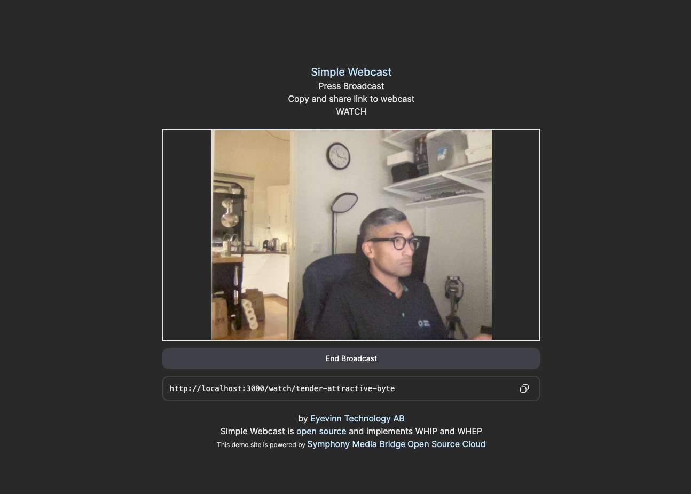

<h1 align="center">
  Simple Webcast
</h1>

<div align="center">
  Simple Webcast - Demo application for WebRTC based distribution with WHIP and WHEP
  <br />

  <br />
  :book: <b><a href="https://docs.osaas.io/osaas.wiki/Solution%3A-WebRTC-distribution.html">Read the documentation (github pages)</a></b> :eyes:
  <br />
</div>

<div align="center">
<br />

[](https://github.com/eyevinn/{{repo-name}}/issues?q=is%3Aissue+is%3Aopen+label%3A%22help+wanted%22)
[](https://github.com/eyevinn)
[](http://slack.streamingtech.se)

</div>

This React application demonstrates how to build a webcast application using the protocols WHIP and WHEP for a standardized WebRTC based distribution of the stream. Online [demo](https://webcast.eyevinn.technolgy) is powered by Symphony Media Bridge and [Open Source Cloud](https://docs.osaas.io/osaas.wiki/Solution%3A-WebRTC-distribution.html).



## Requirements

- Nodejs 18+

## Installation / Usage

```
$ npm install
```

Build and run

```
$ export NEXT_PUBLIC_WHIP_ENDPOINT_URL=<whip-endpoint>
$ export NEXT_PUBLIC_WHIP_API_KEY=<whip-api-key>
$ export NEXT_PUBLIC_WHEP_ENDPOINT_URL=<whep-endpoint>
$ npm run build
$ npm start
```

## Development

Run development server

```
$ npm run dev
```

Access website at http://localhost:3000

## Contributing

See [CONTRIBUTING](CONTRIBUTING.md)

## License

This project is licensed under the MIT License, see [LICENSE](LICENSE).

# Support

Join our [community on Slack](http://slack.streamingtech.se) where you can post any questions regarding any of our open source projects. Eyevinn's consulting business can also offer you:

- Further development of this component
- Customization and integration of this component into your platform
- Support and maintenance agreement

Contact [sales@eyevinn.se](mailto:sales@eyevinn.se) if you are interested.

# About Eyevinn Technology

[Eyevinn Technology](https://www.eyevinntechnology.se) is an independent consultant firm specialized in video and streaming. Independent in a way that we are not commercially tied to any platform or technology vendor. As our way to innovate and push the industry forward we develop proof-of-concepts and tools. The things we learn and the code we write we share with the industry in [blogs](https://dev.to/video) and by open sourcing the code we have written.

Want to know more about Eyevinn and how it is to work here. Contact us at work@eyevinn.se!
